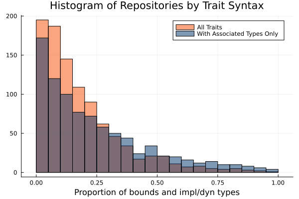
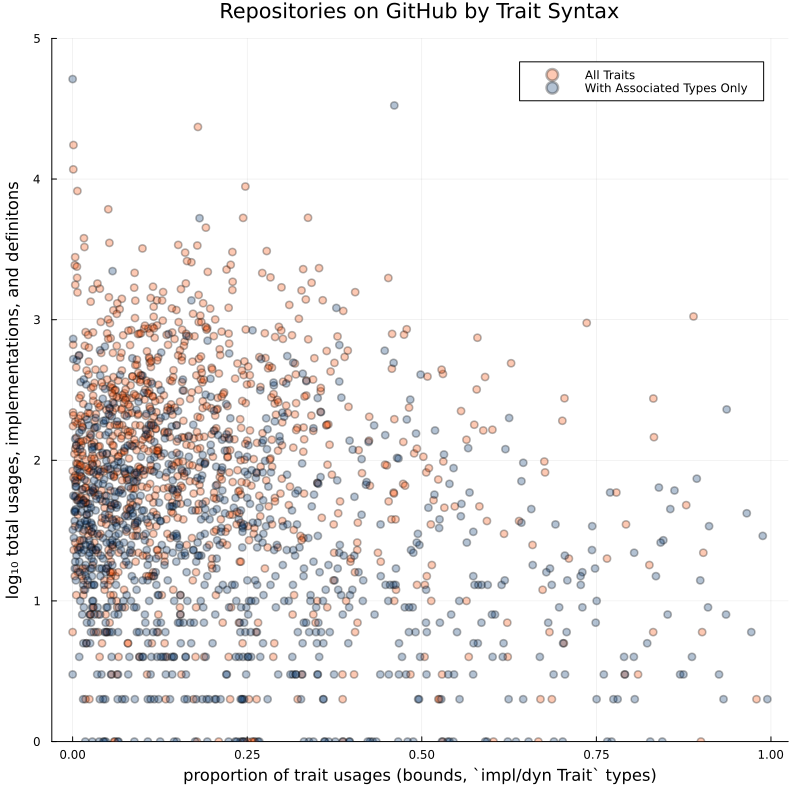

Updates on the positional associated type bounds study! @Josh

We found something sorta unexpected when analyzing Rust code on GitHub to get a feel for how traits get used in the wild (per the project timeline). One of the key assumptions of the PATs proposal is that users will encounter `_: impl Trait`, `where T: Trait`, and other polymorphic function syntaxes earlier in their Rust journey and more often thereafter. This is the motivation for the study: does the simpler type bound syntax encountered while using traits transfer to the experience of defining and implementing traits? That turns out to be totally backwards.

Across the 1,000 top Rust-related GitHub repositories, there are 776,197 total appearances of traits in the syntax tree. 150,074 of those include some sort of associated type. Within any given repository, 72% of the later appearances are part of a trait implementation and 6% are part of a trait definition, on average. Only 22% of appearances are split between the `T: Trait` syntax (11%), `impl Trait` syntax (9%) and `dyn  Trait` syntax (2%) which we call "usage" syntaxes. Here is that broken down by trait name:

|                | `impl Trait for Type {}` | `trait Trait {}` | `dyn Trait` | `impl Trait` | `T: Trait` |
| -------------- | ------- | -------- | ------- | -------- | ----------- |
|       Iterator |  10.02% |    0.01% |   0.39% |    3.17% |       1.30% |
|          Deref |   7.83% |    0.00% |   0.00% |    0.02% |       0.04% |
|        FromStr |   7.72% |    0.00% |   0.00% |    0.00% |       0.02% |
|        TryFrom |   5.70% |    0.00% |   0.00% |    0.00% |       0.02% |
|   IntoIterator |   2.29% |    0.00% |   0.00% |    1.39% |       1.33% |
|             Fn |   0.00% |    0.00% |   0.83% |    1.37% |       2.63% |
|         FnOnce |   0.08% |    0.00% |   0.02% |    0.91% |       2.04% |
|         Future |   1.62% |    0.01% |   0.32% |    0.55% |       0.43% |
|          FnMut |   0.00% |    0.00% |   0.14% |    0.77% |       1.50% |
|            Add |   1.80% |    0.01% |   0.00% |    0.00% |       0.08% |
|          Index |   1.63% |    0.01% |   0.00% |    0.00% |       0.00% |
|         Stream |   0.78% |    0.00% |   0.01% |    0.22% |       0.09% |
|            Mul |   1.00% |    0.00% |   0.00% |    0.00% |       0.06% |
|        Visitor |   1.01% |    0.01% |   0.00% |    0.00% |       0.00% |
|            Sub |   0.93% |    0.00% |   0.00% |    0.00% |       0.04% |
|        Service |   0.73% |    0.02% |   0.00% |    0.00% |       0.08% |
|      Component |   0.52% |    0.01% |   0.00% |    0.00% |       0.00% |
|            Div |   0.45% |    0.00% |   0.00% |    0.00% |       0.02% |
| ObjectSubclass |   0.44% |    0.00% |   0.00% |    0.00% |       0.00% |
|        Handler |   0.33% |    0.04% |   0.00% |    0.00% |       0.07% |
|         Filter |   0.00% |    0.00% |   0.00% |    0.42% |       0.00% |
|          Actor |   0.38% |    0.02% |   0.00% |    0.00% |       0.01% |
|    FromRequest |   0.40% |    0.00% |   0.00% |    0.00% |       0.00% |
|        TryInto |   0.35% |    0.00% |   0.00% |    0.00% |       0.01% |
|          BitOr |   0.32% |    0.00% |   0.00% |    0.00% |       0.01% |

Or including all traits, even ones without associated types:
|                | `impl Trait for Type {}` | `trait Trait {}` | `dyn Trait` | `impl Trait` | `T: Trait` |
| ------------ | ------- | -------- | ------- | -------- | ----------- |
|         From |   9.01% |    0.00% |   0.00% |    0.00% |       0.06% |
|      Display |   6.04% |    0.03% |   0.01% |    0.13% |       0.13% |
|      Default |   5.96% |    0.00% |   0.00% |    0.00% |       0.06% |
|        Debug |   3.18% |    0.00% |   0.01% |    0.02% |       0.22% |
|        Error |   1.17% |    0.01% |   1.47% |    0.01% |       0.07% |
|     Iterator |   1.62% |    0.00% |   0.05% |    0.56% |       0.25% |
|         Drop |   2.41% |    0.00% |   0.00% |    0.01% |       0.00% |
|        AsRef |   0.42% |    0.00% |   0.00% |    0.64% |       0.47% |
|        Clone |   1.03% |    0.00% |   0.00% |    0.11% |       0.30% |
|    PartialEq |   1.26% |    0.00% |   0.00% |    0.00% |       0.10% |
|      FromStr |   1.25% |    0.00% |   0.00% |    0.00% |       0.05% |
|        Write |   0.62% |    0.01% |   0.19% |    0.12% |       0.20% |
|        Deref |   1.04% |    0.00% |   0.00% |    0.00% |       0.01% |
| IntoIterator |   0.35% |    0.00% |   0.00% |    0.27% |       0.30% |
|           Fn |   0.02% |    0.00% |   0.15% |    0.23% |       0.49% |
|      TryFrom |   0.85% |    0.00% |   0.00% |    0.00% |       0.01% |
|         Into |   0.32% |    0.00% |   0.00% |    0.26% |       0.22% |
|           Eq |   0.58% |    0.00% |   0.00% |    0.00% |       0.13% |
|        FnMut |   0.02% |    0.00% |   0.07% |    0.22% |       0.38% |
|       Future |   0.32% |    0.00% |   0.04% |    0.20% |       0.12% |
|         Read |   0.29% |    0.01% |   0.21% |    0.07% |       0.09% |
|    Serialize |   0.46% |    0.00% |   0.00% |    0.01% |       0.14% |
|   PartialOrd |   0.57% |    0.00% |   0.00% |    0.00% |       0.04% |
|         Hash |   0.45% |    0.00% |   0.00% |    0.00% |       0.11% |
|       FnOnce |   0.02% |    0.00% |   0.00% |    0.18% |       0.33% |

Of traits with associated types, only Fn\* are used as bounds more often than they are implemented, but that is only because explicit implementation is disallowed on the stable toolchain. Closures exists specifically to implement Fn\* on custom logic, and there are 670,261 of them in the repositories we scraped.

Instead of considering the *average* syntax breakdown, we can put repositories on a histogram according to the prevalence of usage syntaxes (`_: dyn Trait`, `_: impl Trait`, and `fn<T: Trait>`/`where T: Trait`) out out of total trait syntaxes including implementations and definitions (`trait Trait {}`, `impl Trait for Type { }`). As you can see, it is rare that a repository has fewer trait implementations than trait arguments/return types:

Or break crates down by total count and syntax type:

How is this possible? Functions are used far more often than they are implemented, and we assumed the same would be true of traits. In retrospect it is obvious: traits enable dependency inversion. Let’s say you have a function and you want to call it with 3 different types. Maybe you start out with copy/paste or with an enum, but eventually you'll abstract over the shared aspects of those types using a trait. So you can get 1 trait def and >3 trait impls despite a single function actually using that trait as a bound.

Users of Rust mostly interact with the trait system in order to pass their own types to functions imported from other modules. Trait implementations are written more often than trait bounds, are probably encountered first by new users, and should generally be prioritized over trait bounds in design trade-offs!

So where does this leave the survey project? On one hand, it is quite sucessful. Already we've proved that empirical data can change how we think about a features's design. If all our assumptions made it through this project intact, then the survey would have had no real point. On the other hand, the original plan to study concept transfer from trait bounds to trait implementations has been completely derailed. Here are the 4 directions we can think of going forward:

1. Keep working towards a user survey but pivot the focus. Figure out how trait implementation transfers to writing generic functions, and see if there are improvements that can be made to the implementation syntax. Given Iterator implementations alone make up 10% of all associated type usages on average, maybe dig into generators/coroutines?

2. Don't pivot at all. The direction of concept transfer may have reversed, but we still want to know how beginning Rust programmers handle named associated type bounds vs positional associated type bounds.

3. Continue the syntax analytics, now that we've got a pretty good system. See if there are assumptions made by other RFCs or WGs that can be validated or rejected by parsing lots of GitHub repositories.

4. GIve up on positional associated types as a shippable feature for now, but take some of the lessions learned and implement them in the Rust compiler. See if rust-analyzer/cargo-fix can automatically insert or remove `Item=` terms when the user forgets them or includes them incorrectly.

Currently @Collin and I are leaning towards doing \#3 and \#4. The questions \#2 could answer just don't seem as interesting or important now. Plus, we are well behind scehdule on survey approval beuracracy and would wind up really crunched for time. That is doubly true of \#1 since there is no way to think up an entirly new survey topic and get it approved in the remaining 6-7 weeks we have this semester. It could overflow to next year, but we'd be persuing it on our own time.

What does everyone think?
